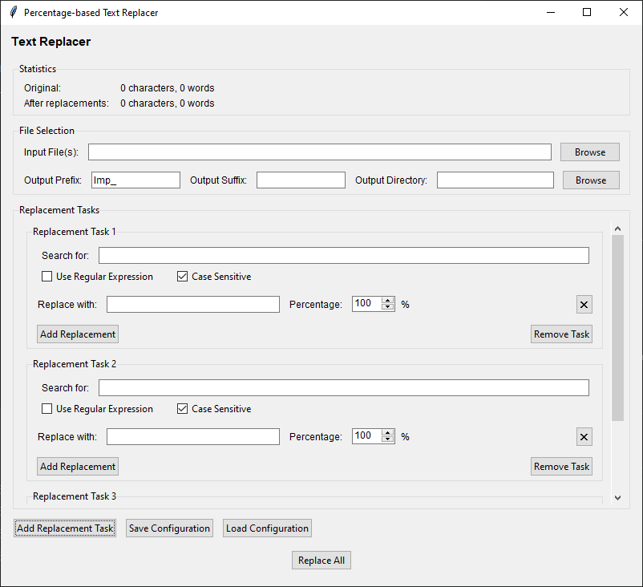

# Percentage-based Text Replacer

A lightweight GUI application for performing controlled, percentage-based text replacements across one or more text files.

## Features

* **Multiple Replacement Tasks**: Define as many search-and-replace tasks as needed.
* **Percentage Control**: Specify what fraction of matches to replace for each replacement option.
* **Regex & Case Options**: Toggle regular expressions and case sensitivity per task.
* **Batch Processing**: Select multiple files and process them concurrently for speed.
* **Configuration Persistence**: Save and load your replacement setup as a JSON file.
* **Statistics**: View character and word counts before and after replacements.





## Installation

1. Ensure you have **Python 3.6+** installed.

2. Install dependencies (if not already available):

   ```bash
   pip install tk
   ```

3. Place `text_replacer.py` in your working directory.

## Usage

```bash
python text_replacer.py
```

1. **Select Input File(s)**: Use the **Browse** button to choose one or more text files.
2. **Set Output Options**: Define an output prefix, suffix, and directory for modified files.
3. **Add Replacement Tasks**: Click **Add Replacement Task**, enter a search term, add one or more replacements with percentages, and toggle regex or case sensitivity.
4. **Save/Load Configuration**: Persist your setup for future runs with **Save Configuration** and **Load Configuration**.
5. **Run Replacements**: Click **Replace All** to process files. View progress and final statistics.
